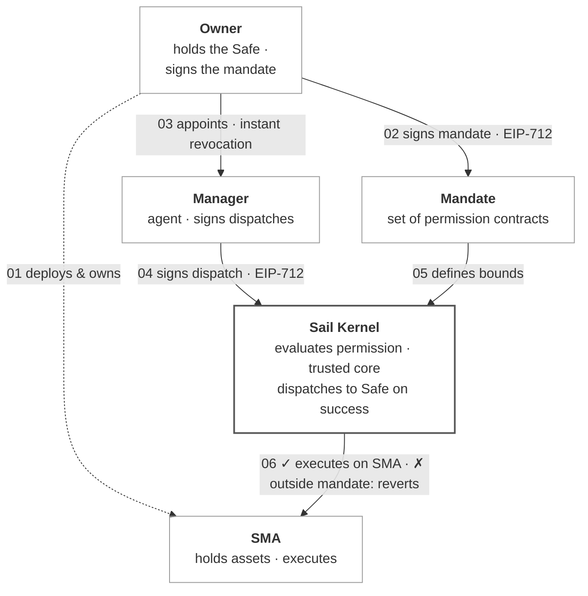

# Sail Protocol

**Onchain Separately Managed Accounts Run by Agents**

[Whitepaper](./docs/whitepaper/Sail_Protocol_Whitepaper.pdf) · [sail.money](https://sail.money)

---

Sail Protocol is a protocol for onchain separately managed accounts (SMAs), implemented for the Ethereum Virtual Machine. Capital is held in a self-custodial Safe owned by the LP; a designated manager—typically an autonomous agent—executes transactions within a mandate enforced by smart contracts on every dispatch. The mandate is a set of user-deployed Solidity permission contracts registered against the account. The manager's signature names one registered permission as the authorizer for each dispatch; the kernel evaluates that permission via `staticcall` under a gas cap and forwards the call to the Safe only if it returns true. Because permissions are arbitrary Solidity, any DeFi primitive can be expressed as a permission. The trusted core is deployed at the same address on every supported chain, and an SMA derives the same address on every chain.

## Protocol Model



### Three Roles

| Role | Authority | Held by |
|---|---|---|
| **Owner** | Holds the Safe. Custodies the SMA's capital. Always self-custodial. | The LP, who owns the Safe. |
| **Permission Signer** | Authorizes the mandate. Signs registration, configuration, and revocation of permissions via EIP-712. | The Owner, or a separate signing key or multisig. |
| **Manager** | Executes transactions within bounds. Cannot exceed what the registered permissions allow. | EOA, multisig, MPC wallet, or autonomous agent. |

The transaction submitter—the address that pays gas and submits the manager's signed dispatch—is not an authority role. Any address may submit; authority derives from the Manager's signature, the registered permissions, and the kernel's evaluation. This makes the protocol natively compatible with relayers, paymasters, and ERC-4337 bundlers.

### The Mandate

In Sail, the mandate is not a document. It is the set of permissions registered for an SMA—contracts implementing `IPermission` that define what the Manager is authorized to do. The Safe is the account the mandate applies to; it is not itself part of the mandate.

When the Manager submits a transaction, the signature names one registered permission as the authorizer. The kernel calls `evaluate()` on that permission alone and dispatches the call to the Safe only if it returns true. If the manager attempts to swap on an unallowed router, transfer to an unallowed recipient, borrow above the configured LTV, or call any function outside the registered permission set, the transaction reverts before any state change occurs.

## Permission System

A permission is a contract implementing a single interface:

```solidity
interface IPermission {
    function evaluate(bytes calldata txData, Context calldata ctx)
        external view returns (bool);
    function discriminator() external view returns (bytes32);
}

struct Context {
    address account;         // the Safe
    address manager;         // the delegated signer
    address submitter;       // msg.sender of the dispatch (may be a relayer)
    address target;          // call target
    bytes4  selector;        // call selector
    uint256 value;           // msg.value
    uint256 blockTimestamp;
    uint256 blockNumber;
}
```

### Evaluation Semantics

The kernel's evaluation enforces four properties on every dispatch:

- **Static evaluation.** Permissions are called via `staticcall`, which prohibits state mutation. A permission cannot modify any contract's storage during evaluation. Reentrancy through the permission surface is structurally impossible.
- **Gas isolation.** Each permission is called with a fixed gas cap of 150,000. A permission that exceeds its cap reverts and is treated as returning false. A pathological permission cannot deny service to the kernel or consume the manager's gas budget beyond the cap.
- **Selective authorization.** The manager's signature names one registered permission as the authorizer for the dispatch. The kernel evaluates that permission alone—no other registered permissions are consulted. This enables unrelated templates to coexist on one account: a swap permission, a borrow permission, and a transfer permission can all be registered, and each call selects the appropriate authorizer without the others falsely denying it.
- **Fail-closed.** Any permission that reverts, runs out of gas, returns malformed data, or returns false causes the entire dispatch to revert. The default behavior of a buggy permission is to deny, not to allow.

### Full Expressiveness

Because permissions are arbitrary Solidity contracts, the protocol does not bound what a permission can express. The kernel knows nothing about DeFi venues—it calls `evaluate()` on a permission contract and respects the answer. The structural guarantees—`staticcall`, gas cap, fail-closed, selective authorization—protect the kernel from the permission; everything the permission expresses inside that envelope is the author's responsibility. Adding a new DeFi integration to Sail is a contract deployment, not a protocol upgrade.

### Example Templates

| Template | Gates |
|---|---|
| SharedBoundedSwapPermission | AMM swaps. Router allowlist, token allowlist, per-transaction amount cap, optional oracle-based slippage check. |
| SharedBoundedBorrowPermission | Lending borrows. Protocol allowlist, asset allowlist, LTV check against a collateral value oracle. |
| SharedTransferTargetPermission | ERC-20 transfers. Recipient allowlist, token allowlist. |
| SharedDeFiBundlePermission | Composite: swap, borrow, and transfer in one registered permission. Selector-routed evaluation. |
| SharedPendlePermission | Yield-protocol router: liquidity, principal-token and yield-token swaps, mint/redeem, claim rewards. |
| SharedAMMLiquidityPermission | Concentrated liquidity operations on AMM position managers. |
| SharedApproveAndCallBatchPermission | Batch: atomic approve / protocol call / reset sequence. Token allowlist, spender allowlist, amount cap, mandatory reset to zero. |

Templates are demonstrations of the permission pattern, not the protocol itself. Anyone may deploy additional permission contracts for any DeFi venue; the kernel will register and dispatch through any contract that implements `IPermission`.

## Deterministic Deployment and Chain-Portable Accounts

The trusted core is deployed through a CREATE2 factory with chain-independent salts and identical constructor arguments on every supported chain. Every core contract—kernel, governance, timelock, factory, fee policy, module enabler—lives at the same address on every supported chain.

Account addresses inherit the property. The kernel derives each account's CREATE2 salt by binding the caller's salt nonce with the account's principals:

```
boundSalt = keccak256(saltNonce, caller, permissionSigner, manager, feePolicy)
```

The same owner, permission signer, manager, fee policy, and salt nonce produce the same SMA address on every supported chain. Binding the principals into the salt also means a counterfactual address cannot be front-run with different principals: a deployment supplying a different manager or signer lands at a different address.

An SMA has one address across every supported chain. Assets sent to that address on any supported chain reach the same account, whether or not the Safe has been deployed there yet.

## Fee Model

The protocol enforces two independent fee mechanisms. Each is capped by an immutable constitutional limit and tunable within that limit by governance.

**Fee 1 — Permission Registration Fee.** When a permission is registered with the kernel, the registering account pays a flat ETH amount to the protocol treasury:

```
total fee = permissionRegistrationFee × n_permissions
```

Bounded above by the immutable cap of 0.001 ETH (`MAX_PERMISSION_FEE_WEI`). The active rate is governance-tunable within this cap. Excess `msg.value` is refunded.

**Fee 2 — Protocol Cut on Manager-Collected Fees.** When the Manager calls `collectFees`, the kernel splits the manager's gross fee:

```
protocol cut = managerGrossFee × currentProtocolCutBps / 10,000
manager take = managerGrossFee − protocol cut − distributor cut
```

The active cut is governance-tunable, bounded above by the immutable cap of 25% (`MAX_PROTOCOL_CUT_BPS = 2,500`). The protocol cut is set to zero at launch.

The fee computation lives in the registered `IFeePolicy` contract. The reference implementation, StandardFeePolicy, provides a management fee on AUM and a performance fee above a per-account high-water mark.

## Governance

Protocol parameters are mutable within the constitutional caps: the active protocol cut (zero at launch); the active registration fee; the trusted Safe factory, singleton, proxy-codehash, and fee-policy allowlists; and the emergency admin. Parameter mutations require a 48-hour timelock delay. Governance transfer is two-step (propose and accept). Emergency pause has auto-expiry and a cooldown between invocations.

The timelock is a standalone contract injected at construction. SailGovernance validates it at construction—the delay must equal 48 hours exactly, governance must hold both the proposer and executor roles, and the timelock must administer its own roles with no external account holding administrative power. A deployment that fails any of these checks reverts.

## Security Properties

The protocol provides six guarantees as properties of the deployed bytecode:

1. **Custody isolation.** The kernel cannot transfer Safe assets except through a manager dispatch that satisfies the named permission's evaluation. The kernel has no direct write access to the Safe outside the module dispatch path.
2. **Selective authorization.** A dispatch succeeds only if the permission named in the manager's signature is registered for the account and returns true on evaluation.
3. **Reentrancy safety.** Permission evaluation occurs via `staticcall`, which prohibits state mutation. No re-entry path exists through the permission surface.
4. **Gas isolation.** Each permission is called under a fixed gas cap; exceeding it is treated as returning false. The kernel cannot be denied service by a malicious permission.
5. **Constitutional fee caps.** Protocol cut and registration fee cannot exceed their immutable bounds under any governance procedure.
6. **Signer separation.** The Permission Signer cannot move Safe assets. The Manager cannot register or revoke permissions. The Safe Owner can always revoke the Manager.

## Components

| Component | Role |
|---|---|
| **SailKernel** | Account registration, permission registry, EIP-712 signature verification, manager dispatch via Safe modules, fee collection, principal tracking. |
| **SailGovernance** | Protocol parameter governance behind a 48-hour timelock; emergency pause with auto-expiry and cooldown; two-step governance transfer; trusted Safe factory, singleton, proxy-codehash, and fee-policy allowlists. |
| **TimelockController** | Standalone timelock, deployed separately and injected into SailGovernance, which validates it at construction. |
| **SafeModuleEnabler** | Stateless helper that enables the kernel as a Safe module during account creation. |
| **MandateFactory** | UX orchestrator. Bundles permission configuration, registration, replacement, and detachment into single transactions. Holds no protocol-level privileges. |
| **StandardFeePolicy** | Reference fee policy: management fee on AUM, performance fee above a per-account high-water mark. |
| **Shared\*Permission** | Starter set of shared permission templates covering common DeFi primitives (see table above). |

## Deployments

All core contracts are deployed at identical addresses on every supported chain via CREATE2 (commit `1199b33`, deployed 2026-06-09).

### Core addresses

| Contract | Address |
|---|---|
| SailKernel | `0x02ABC18B65A328de2e749F56ba79ACF2718a6659` |
| SailGovernance | `0x7A478118715791728BDE3bc7A4D7ECfdEB89C6EC` |
| TimelockController | `0xE48Ba8DB6d748adafD13155c3590f62e58a77f56` |
| MandateFactory | `0x14EDd6c2a56EfC0d71E215ab13094B9AF90543d2` |
| StandardFeePolicy | `0xe7B5901b839cFFDEd9D4108A22712C8BfdA1D80D` |
| SafeModuleEnabler | `0x7897Cb53a4be4a2eaAf46D60573C4Fd83b33fE1F` |

### Supported chains

| Chain | Chain ID | Status |
|---|---|---|
| Ethereum | 1 | live |
| Base | 8453 | live |
| Arbitrum | 42161 | live |
| Unichain | 130 | live |
| Base Sepolia | 84532 | live |
| Eth Sepolia | 11155111 | live |

See [deployments/addresses.md](./deployments/addresses.md) for full deployment details.

## Build and test

```bash
forge install   # install dependencies
forge build     # compile all contracts
forge test      # run test suite
forge test -vvv # verbose output with traces
```

## Security

The Sail Protocol contracts have been submitted for audit by Octane Security. The audit is ongoing; findings are being addressed as received. See [docs/SECURITY.md](./docs/SECURITY.md) for scope and known issues.

To report a vulnerability: security@sail.money

## License

GPL-2.0-or-later. See [LICENSE](./LICENSE).

Built on [Gnosis Safe v1.4.1](https://github.com/safe-global/safe-smart-account) and [OpenZeppelin Contracts v5](https://github.com/OpenZeppelin/openzeppelin-contracts).
