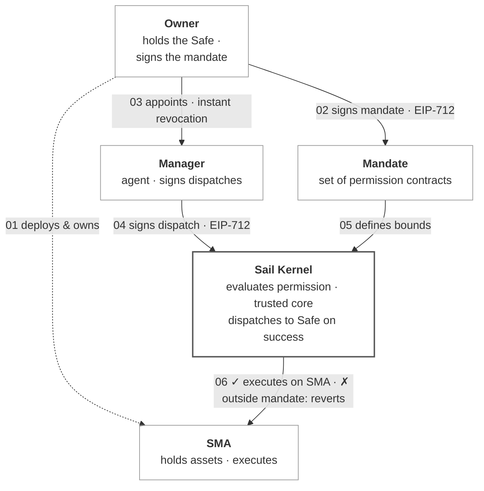

<p align="center">
  
</p>

# Sail Protocol

**Onchain Separately Managed Accounts Run by Agents**

[Whitepaper](./docs/whitepaper/Sail_Protocol_Whitepaper.pdf) · [sail.money](https://sail.money)

---

## What is Sail

Sail Protocol is an onchain primitive for separately managed accounts (SMAs) run by agents. Capital stays in a self-custodial Safe the owner controls; a designated manager — typically an autonomous agent — executes only what a mandate allows. The mandate is a set of user-deployed Solidity permission contracts registered to the account; on each dispatch the manager names one registered permission, and the kernel evaluates that permission under a gas cap via `staticcall`, forwarding the call to the Safe only if it returns true. Because permissions are arbitrary Solidity, any DeFi primitive can be expressed as one. Protocol fees are bounded by immutable constitutional caps.

The core contracts and shared permission templates were reviewed by Octane Security across multiple analyses; all reported vulnerabilities resolved or acknowledged. The most recent analysis (2026-06-29) identified no critical- or high-severity findings. See [Security](#security).

## Why it exists

Autonomous agents can act onchain continuously, but to operate capital they do not own they need two things at once: the ability to sign transactions, and enforceable limits on what they may do. A legal mandate cannot bind software executing at machine speed — the bounds must be code, evaluated on every transaction and revocable in a single block. Encoding the mandate onchain also changes what a strategy can be: instead of one template applied uniformly across a book of accounts, an agent can run *dynamic asset management* — a distinct strategy per account, continuously calibrated to each owner's balance, risk tolerance, time horizon, and liquidity needs.

## How it works



### Three roles

| Role | Authority | Held by |
|---|---|---|
| **Owner** | Holds the Safe. Custodies the SMA's capital. Always self-custodial. | The account owner, whose capital it holds. |
| **Permission Signer** | Authorizes the mandate. Signs registration, configuration, and revocation of permissions via EIP-712. | The Owner, or a separate signing key or multisig. |
| **Manager** | Executes transactions within bounds. Cannot exceed what the registered permissions allow. | An autonomous agent or a human operator; the signing key may be an EOA, multisig, or MPC wallet. |

The transaction submitter — the address that pays gas and submits the manager's signed dispatch — is not an authority role. Any address may submit; authority derives from the Manager's signature, the registered permissions, and the kernel's evaluation. This makes the protocol natively compatible with relayers, paymasters, and ERC-4337 bundlers.

### The mandate

The mandate is the set of permissions registered for an SMA — contracts implementing `IPermission` that define what the Manager is authorized to do. The Safe is the account the mandate applies to; it is not itself part of the mandate.

When the Manager submits a transaction, the signature names one registered permission as the authorizer. The kernel calls `evaluate()` on that permission alone and dispatches the call to the Safe only if it returns true. If the manager attempts to swap on an unallowed router, transfer to an unallowed recipient, borrow above the configured LTV, or call any function outside the registered permission set, the transaction reverts before any state change occurs.

### Trusted core components

| Component | Role |
|---|---|
| **SailKernel** | Account registration, permission registry, EIP-712 signature verification, manager dispatch via Safe modules, fee collection, principal tracking. |
| **SailGovernance** | Protocol parameter governance behind a 48-hour timelock; emergency pause with auto-expiry and cooldown; two-step governance transfer; trusted Safe factory, singleton, proxy-codehash, and fee-policy allowlists. |
| **TimelockController** | Standalone timelock, deployed separately and injected into SailGovernance, which validates it at construction. |
| **SafeModuleEnabler** | Stateless helper that enables the kernel as a Safe module during account creation. |
| **MandateFactory** | UX orchestrator. Bundles permission configuration, registration, replacement, and detachment into single transactions. Holds no protocol-level privileges. |

## Evaluation guarantees

A permission is a contract implementing a single interface:

```solidity
interface IPermission {
    function evaluate(bytes calldata txData, Context calldata ctx)
        external view returns (bool);
    function discriminator() external view returns (bytes32);
}

struct Context {
    address account;         // the Safe
    address manager;         // the delegated signer
    address submitter;       // msg.sender of the dispatch (may be a relayer)
    address target;          // call target
    bytes4  selector;        // call selector
    uint256 value;           // msg.value
    uint256 blockTimestamp;
    uint256 blockNumber;
}
```

The kernel enforces four properties on every dispatch:

- **Static evaluation.** Permissions are called via `staticcall`, which prohibits state mutation. A permission cannot modify any contract's storage during evaluation. Reentrancy through the permission surface is structurally impossible.
- **Gas isolation.** A single-dispatch `evaluate` is called with a fixed gas cap of 150,000; a batch `evaluateBatch` under 1,000,000. A permission that exceeds its cap reverts and is treated as returning false. A pathological permission cannot deny service to the kernel or consume the manager's gas budget beyond the cap.
- **Selective authorization.** The manager's signature names one registered permission as the authorizer for the dispatch. The kernel evaluates that permission alone — no other registered permissions are consulted. This lets unrelated templates coexist on one account: a swap permission, a borrow permission, and a transfer permission can all be registered, and each call selects the appropriate authorizer without the others falsely denying it.
- **Fail-closed.** Any permission that reverts, runs out of gas, returns malformed data, or returns false causes the entire dispatch to revert. The default behavior of a buggy permission is to deny, not to allow.

### Batch dispatch

The kernel exposes a second entry point, `dispatchBatch`, that executes a sequence of Safe module calls as a single atomic transaction. A batch is gated by exactly one batch-aware permission — a contract implementing `IBatchPermission` — named in the manager's signature. The named permission owns validation of every subcall and any cross-call invariants (matching amounts, mandatory cleanup, ordering):

```solidity
interface IBatchPermission {
    function evaluateBatch(Call[] calldata calls, BatchContext calldata ctx)
        external view returns (bool);
    function isBatchPermission() external pure returns (bool);
}

struct Call {
    address target;   // subcall target; must not be the kernel
    uint256 value;     // native ETH forwarded (wei)
    bytes   data;      // subcall calldata
}
```

`evaluateBatch` is called via `staticcall` under `BATCH_EVAL_GAS_CAP` (1,000,000) and is fail-closed identically to single dispatch. The kernel detects batch support through `isBatchPermission()`, which implementations must return `true`. Batch permissions exist for invariants that per-call evaluation cannot express — for example the approve / call / reset-to-zero sequence, where each call is individually unsafe but the bounded triple is safe.

## Permission templates

Because permissions are arbitrary Solidity contracts, the protocol does not bound what a permission can express. The kernel knows nothing about DeFi venues — it calls `evaluate()` and respects the answer. Adding a new DeFi integration is a contract deployment, not a protocol upgrade.

A reference set of multi-tenant templates ships with the protocol. They are swappable defaults, not the protocol itself: anyone may deploy additional permission contracts for any venue, and the kernel registers and dispatches through any contract that implements `IPermission`. All seven inherit a shared base, `ConfigurablePermission`, which provides per-account configuration (EIP-712 domain, per-account nonces, ECDSA and ERC-1271 verification) and is not deployed on its own.

| Template | Gates |
|---|---|
| SwapPermission | DEX swaps. Router and token allowlists, size cap, output paid to the account, slippage floor against an independent price oracle. |
| SwapPermissionNoOracle | DEX swaps without an external oracle. Router and token allowlists, size cap, slippage floor against the reference pool's own live price (V2 reserves / V3 `sqrtPriceX96`). |
| BorrowPermission | Lending borrows. Protocol and asset allowlists, size cap, position credited to the account, optional LTV ceiling against oracles. |
| DepositPermission | Deposits into allowlisted vaults and lending pools. Token and target allowlists, size cap, position credited to the account. |
| WithdrawPermission | ERC-20 movements pinned to one configured recipient. Token allowlist, size cap, `transferFrom` source must be the account. |
| TransferPermission | ERC-20 sends to an allowlisted recipient set. Token allowlist, size cap, `transferFrom` source must be the account, native ETH rejected. |
| ApproveAndCallBatchPermission | Atomic approve / protocol-call / reset batch. Token and spender allowlists, amount cap, paired (target, selector), mandatory reset to zero. |

Anyone can deploy SMAs, write permissions, and register any contract as a permission — permission registration is permissionless. Governance allowlists apply only to trusted infrastructure: the Safe factory, the Safe singleton, the proxy codehash, and fee policies.

## Fee model

The protocol enforces two independent fee mechanisms. Each is capped by an immutable constitutional limit and tunable within that limit by governance.

**Fee 1 — Permission registration fee.** When a permission is registered with the kernel, the registering account pays a flat ETH amount to the protocol treasury:

```
total fee = permissionRegistrationFee × n_permissions
```

The active rate is a governance-tunable parameter set at deployment and changed only through the 48-hour timelock — not a hardcoded constant. It is bounded by an immutable per-deployment maximum (`MAX_PERMISSION_FEE_WEI`), itself capped at a constitutional ceiling of 0.01 of the chain's native token (0.01 ETH on Ethereum and ETH-denominated chains). Excess `msg.value` is refunded.

**Fee 2 — Protocol cut on manager-collected fees.** When the Manager calls `collectFees`, the kernel splits the manager's gross fee:

```
protocol cut = managerGrossFee × currentProtocolCutBps / 10,000
manager take = managerGrossFee − protocol cut − distributor cut
```

The active cut is governance-tunable, bounded above by the immutable cap of 25% (`MAX_PROTOCOL_CUT_BPS = 2,500`). The protocol cut is zero by default; any non-zero cut is a governance decision within that cap.

The fee computation lives in the registered `IFeePolicy` contract — a swappable default. The reference implementation, `StandardFeePolicy`, provides a management fee on AUM and a performance fee above a per-account high-water mark. Any account may register a different `IFeePolicy`.

## Security model

The protocol provides six guarantees as properties of the deployed bytecode:

1. **Custody isolation.** The kernel cannot transfer Safe assets except through a manager dispatch that satisfies the named permission's evaluation. The kernel has no direct write access to the Safe outside the module dispatch path.
2. **Selective authorization.** A dispatch succeeds only if the permission named in the manager's signature is registered for the account and returns true on evaluation.
3. **Reentrancy safety.** Permission evaluation occurs via `staticcall`, which prohibits state mutation. No re-entry path exists through the permission surface.
4. **Gas isolation.** Each permission is called under a fixed gas cap; exceeding it is treated as returning false. The kernel cannot be denied service by a malicious permission.
5. **Constitutional fee caps.** Protocol cut and registration fee cannot exceed their immutable bounds under any governance procedure.
6. **Signer separation.** The Permission Signer cannot move Safe assets. The Manager cannot register or revoke permissions. The Safe Owner can always revoke the Manager.

### Limitations

- **Permission correctness.** The kernel verifies that a permission is a contract and returns true or false; it does not verify that the permission's logic enforces what its author claims. Users are responsible for the permissions they register.
- **Upgradeable permissions.** The kernel binds a registered permission by its address and does not re-check its code on each dispatch. An upgradeable or otherwise mutable permission can change its `evaluate` behaviour after the Permission Signer has approved it. Register only non-upgradeable, reviewed permission contracts.
- **Manager-attested NAV.** The reference fee policy uses a manager-attested NAV reported at collection time. An inflated NAV could unlock a fee the kernel bounds only by the account's own balance — in the limit approaching a full withdrawal of the account. This model fits accounts where the manager and the owner are the same party; a third-party allocation warrants a fee policy that validates NAV without manager attestation.

See [docs/SECURITY_MODEL.md](./docs/SECURITY_MODEL.md) for the full security model and threat analysis.

## Deterministic deployment and supported chains

The trusted core is deployed through a CREATE2 factory with chain-independent salts and identical constructor arguments. Across chains that share identical core construction, every core contract — kernel, governance, timelock, factory, fee policy, module enabler — lives at the same address, and each SMA resolves to one address. The kernel derives each account's CREATE2 salt by binding the caller's salt nonce with the account's principals:

```
boundSalt = keccak256(saltNonce, caller, permissionSigner, manager, feePolicy)
```

Binding the principals into the salt means a counterfactual address cannot be front-run with different principals: a deployment supplying a different manager or signer lands at a different address. The same-address property holds only where the construction arguments match — including the registration-fee ceiling, which is denominated in the chain's native token; a chain whose native token differs materially may be deployed with a different ceiling and resolve to different addresses.

The protocol is deployed on **Ethereum, Base, Arbitrum, and Unichain** (with Base Sepolia and Ethereum Sepolia testnets). See [deployments/addresses.md](./deployments/addresses.md) for the authoritative, per-chain contract addresses.

## Documentation

**Start here**
- [Whitepaper](./docs/whitepaper/Sail_Protocol_Whitepaper.pdf) — protocol design and rationale
- [docs/spec.md](./docs/spec.md) — technical specification

**Build on Sail**
- [docs/INTEGRATION.md](./docs/INTEGRATION.md) — integrator guide
- [docs/KERNEL.md](./docs/KERNEL.md) — kernel reference
- [docs/TEMPLATES.md](./docs/TEMPLATES.md) — permission templates
- [docs/FEE_POLICIES.md](./docs/FEE_POLICIES.md) — authoring fee policies

**Operate & govern**
- [docs/GOVERNANCE.md](./docs/GOVERNANCE.md) — governance parameters and process
- [docs/SECURITY_MODEL.md](./docs/SECURITY_MODEL.md) — security model and known limitations
- [DEPLOYMENT.md](./docs/DEPLOYMENT.md) — deployment runbook

**Reference**
- [docs/ARCHITECTURE.md](./docs/ARCHITECTURE.md) — architecture overview
- [docs/GLOSSARY.md](./docs/GLOSSARY.md) — glossary of protocol terms
- Advanced: [docs/agent-identity.md](./docs/agent-identity.md) · [docs/off-chain-attribution.md](./docs/off-chain-attribution.md)

## Build and test

```bash
forge install   # install dependencies
forge build     # compile all contracts
forge test      # run test suite
```

Built with Foundry (solc 0.8.26, EVM `cancun`, `via_ir`).

## Contributing

Contributions are welcome. `main` is protected and changes land via pull request; keep each PR to one logical unit, and run `forge build` and `forge test` before opening it. File issues and questions on the repository's issue tracker.

## Security

The core contracts and shared permission templates were reviewed by Octane Security across multiple analyses during pre-launch; all reported vulnerabilities have been resolved or acknowledged, and the remaining lower-severity warnings are documented or accepted by design. The most recent analysis (2026-06-29) identified no critical- or high-severity findings. Full reports and the security log are in [docs/security](./docs/security/).

To report a vulnerability: hello@sail.money. Please do not open public issues for security reports.

## License

GPL-2.0-or-later. See [LICENSE](./LICENSE).

Built on [Gnosis Safe v1.4.1](https://github.com/safe-global/safe-smart-account) and [OpenZeppelin Contracts v5](https://github.com/OpenZeppelin/openzeppelin-contracts).
